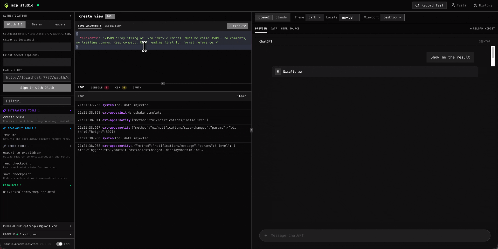
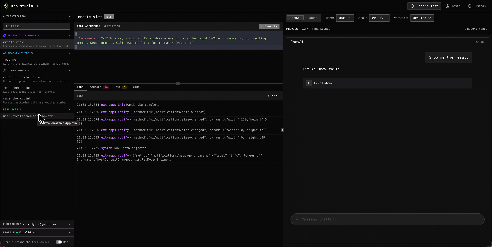
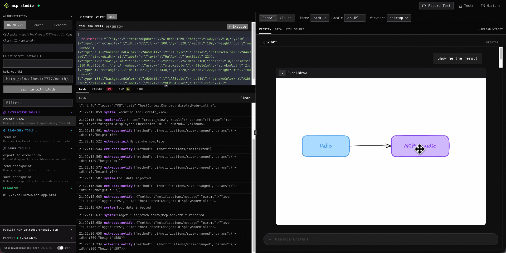
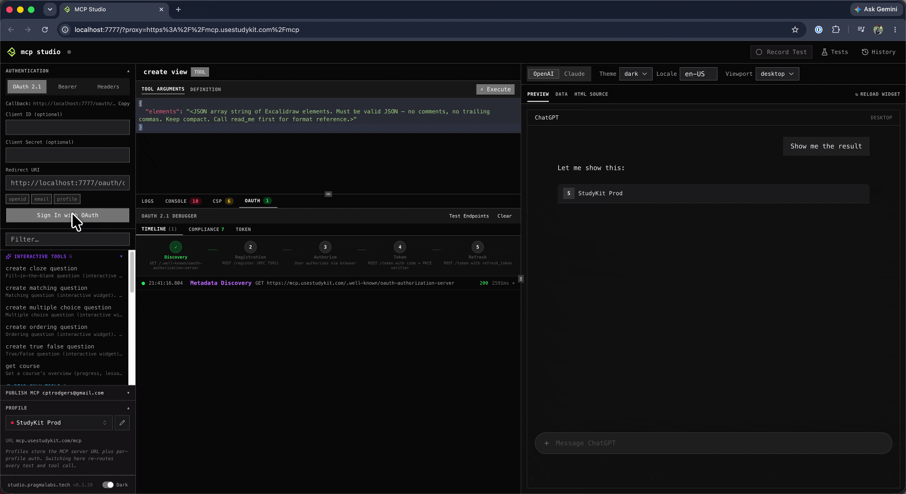

# mcp-studio

The E2E Test Solution for ChatGPT Apps, Claude Connector, and MCP Apps.

## Demo

[](https://www.youtube.com/watch?v=vCbNQKFpN78)

## Features

- **Call tools & read resources** — connect to any MCP server and inspect responses instantly
- **Widget preview** — render your MCP app's UI widgets and interact with them in ChatGPT, Claude, desktop, and mobile viewports
- **Record & replay E2E tests** — hit Record, use your app, stop; the session becomes a reproducible test stored as plain JSON
- **CI/CD headless runner** — replay tests without a browser window; exits non-zero on failure so it gates your pipeline
- **OAuth 2.1 debugger** — runs the full PKCE flow and shows every step: discovery, registration, authorization, and token exchange
- **No database** — tests and reports are plain JSON files, git-friendly and human-readable

---

## Install

```sh
npx @pragmalabs/mcp-studio open http://localhost:3000
```

Other install options (curl, Homebrew, build from source): [studio.pragmalabs.tech/docs](https://studio.pragmalabs.tech/docs)

---

## Use cases

### Call MCP tools

Connect to any MCP server and call its tools with custom arguments. Responses appear instantly in the log.



---

### Read MCP resources

Browse and read resources from your MCP server. Inject test data to preview how widgets respond.



---

### Preview and interact with widgets

See your MCP app widget render live in the browser. Switch between ChatGPT, Claude, desktop, and mobile viewports.



---

### Record and replay E2E tests

**Step 1 — Record.** Hit Record in the studio, use your MCP app normally (call tools, read resources, click widgets), then stop. The session is saved as a JSON file.


**Step 2 — Find your test file.** Tests are saved to `~/.mcp-studio/tests/<test-name>.json` by default. To save them somewhere version-controllable, point the studio at a directory in your repo:

```sh
mcp-studio --tests-dir ./tests
```

**Step 3 — Commit.** Test files are plain JSON — commit them alongside your server code:

```sh
git add tests/
git commit -m "add smoke test"
```

**Step 4 — Replay.** Open the studio and click Replay on any saved test. Each recorded action is re-executed against your live server and verified against the baseline.

---

### Run tests in CI/CD (headless mode)

Headless mode runs your recorded tests without opening a browser window and exits with a non-zero code on failure. It requires **Chrome or Chromium** to be installed on the CI runner.

```sh
mcp-studio --tests-dir ./tests --headless --test-id my-test --test-id another-test
```

Full GitHub Actions example:

```yaml
- name: Set up Chrome
  uses: browser-actions/setup-chrome@v1

- name: Run MCP Studio tests
  run: npx @pragmalabs/mcp-studio --tests-dir ./tests --headless --test-id smoke-test
```

- `--tests-dir` must point to the directory where you committed your test JSON files.
- Repeat `--test-id` for each test you want to run.
- The process exits `0` on success, non-zero on any test failure.

---

### Debug OAuth 2.1

MCP Studio runs the full OAuth 2.1 + PKCE flow automatically and shows a live log of every step: discovery, registration, authorization, and token exchange.



---

## License

[MIT](./LICENSE)
